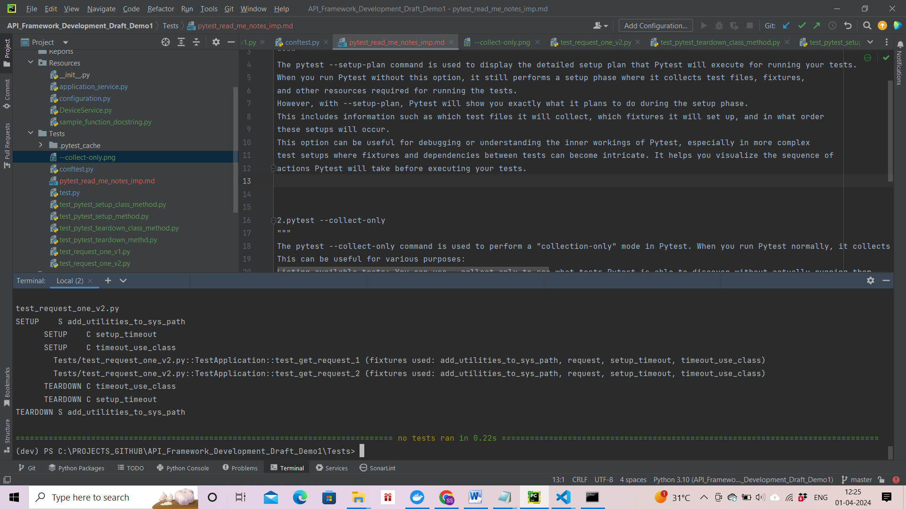
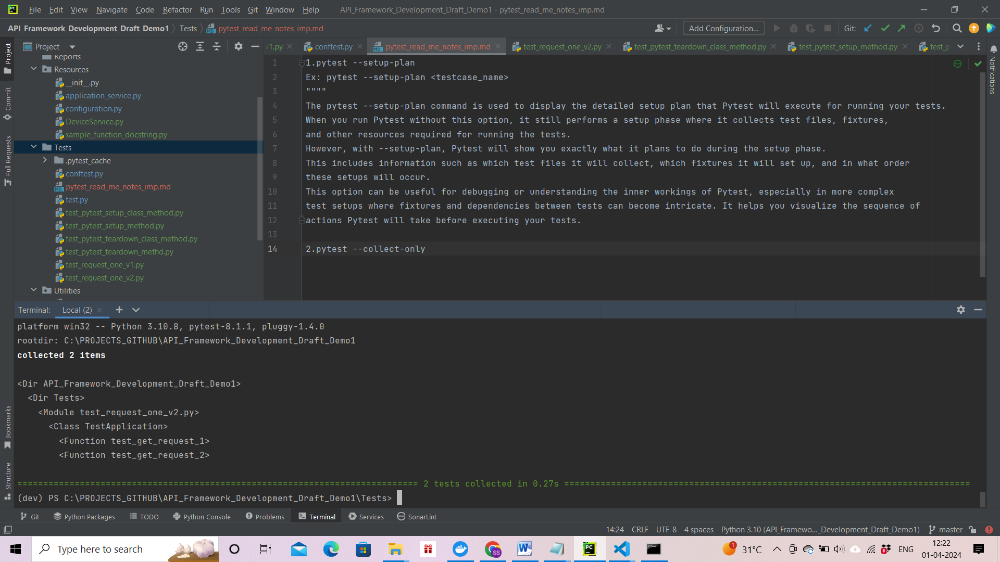

1.pytest --setup-plan
Ex: pytest --setup-plan <testcase_name>
""""
The pytest --setup-plan command is used to display the detailed setup plan that Pytest will execute for running your tests.
When you run Pytest without this option, it still performs a setup phase where it collects test files, fixtures, 
and other resources required for running the tests.
However, with --setup-plan, Pytest will show you exactly what it plans to do during the setup phase.
This includes information such as which test files it will collect, which fixtures it will set up, and in what order
these setups will occur.
This option can be useful for debugging or understanding the inner workings of Pytest, especially in more complex
test setups where fixtures and dependencies between tests can become intricate. It helps you visualize the sequence of 
actions Pytest will take before executing your tests.

2.pytest --collect-only
"""
The pytest --collect-only command is used to perform a "collection-only" mode in Pytest. When you run Pytest normally, it collects test files, functions, classes, and fixtures and then runs the tests. However, with --collect-only, Pytest only collects the tests without executing them.
This can be useful for various purposes:
Listing available tests: You can use --collect-only to see what tests Pytest is able to discover without actually running them. 
This is helpful for understanding which tests Pytest is aware of and how it categorizes them.
Debugging test discovery issues: If Pytest is not finding certain tests as you expect, --collect-only can help diagnose the problem 
by showing what tests Pytest is able to find and how it's organizing them.
Integration with other tools: You can use --collect-only to integrate Pytest with other tools or scripts, where you may want to gather
information about tests without actually running them.
To summarize, pytest --collect-only is a useful command for inspecting the test collection process in Pytest without executing the tests themselves.
"""

3.Logger for all the pytest testcase.
Firt create the logger function in the conftest.py file